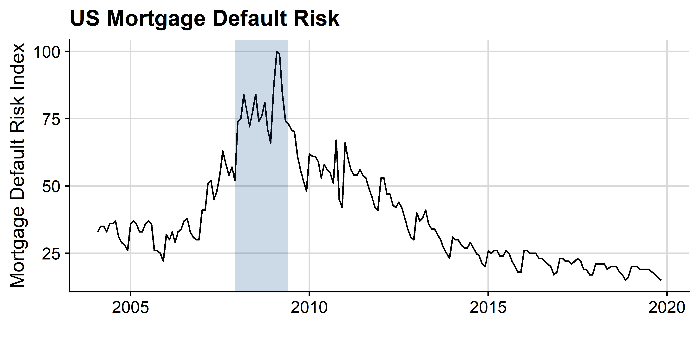

# The Mortgage Default Risk Index (MDRI)

### Mortgage Default Risk (the MDRI) has decreased 11.12% over the last 12 months:

### An interactive data app for the MDRI can be found [here](XXX).

The Mortgage Default Risk Index is from Chauvet, Gabriel, and Lutz
(2016). The data in the plot are not seasonally and the blue bar in the plot is
a bear market in the S&P500. See below for other available MDRI datasets.

Chauvet, Marcelle, Stuart Gabriel, and Chandler Lutz. "Mortgage"
default risk: New evidence from internet search queries." *Journal of
Urban Economics* 96 (2016): 91-111.

### Data Description

The Mortgage Default Risk Index (MDRI) captures household mortgage
default risk by aggregating internet search queries such as
"foreclosure help" and "mortgage help". Chauvet, Gabriel, and Lutz
(2016) find that the MDRI is a leading indicator of traditional
measures of mortgage default risk.

### Download Instructions

* You can downlaod all of the data, including real time, daily,
  and seasonally adjusted data, using the download link above.
* A CSV file for the most recent monthly US data can be found [here](Data/MDRI_US_nsa.csv).
* A CSV file for the most recent state-level data can be found [here](Data/MDRI_States_nsa.csv).
* A CSV file for the most recent city-level data can be found [here](Data/MDRI_Cities_nsa.csv).

